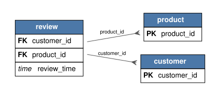

---
tags:
- relbench
- relational-deep-learning
pretty_name: rel-amazon
---

# rel-amazon

Amazon product reviews: customers, products, and time-stamped reviews and ratings across the Amazon catalog.

## Schema



Open [`schema.svg`](schema.svg) for a zoomable view of the foreign-key graph (PK = primary key, FK = foreign key).

Splits: validation `2015-10-01`, test `2016-01-01` (rows up to a split's timestamp are the inputs for that split).

## Tasks

| task | kind | type | description |
|---|---|---|---|
| `item-churn` | forecast | binary_classification | Churn for a product is 1 if the product recieves at least one review in the time window, else 0. |
| `item-ltv` | forecast | regression | LTV (life-time value) for a product is the numer of times the product is purchased in the time window multiplied by price. |
| `review-rating` | autocomplete | regression | Predict the `rating` column of the `review` table. |
| `user-churn` | forecast | binary_classification | Churn for a customer is 1 if the customer does not review any product in the time window, else 0. |
| `user-item-purchase` | forecast | link_prediction | Predict the list of distinct items each customer will purchase in the next two years. |
| `user-item-rate` | forecast | link_prediction | Predict the list of distinct items each customer will purchase and give a 5 star review in the next two years. |
| `user-item-review` | forecast | link_prediction | Predict the list of distinct items each customer will purchase and give a detailed review in the next two years. |
| `user-ltv` | forecast | regression | LTV (life-time value) for a customer is the sum of prices of products that the customer reviews in the time window. |

## Loading

```python
import relbench
ds = relbench.load_dataset("rel-amazon")
task = relbench.load_task("rel-amazon", "<task>")
```

Manifest layout (`manifest.yaml` + plain parquet); see the RelBench [CONTRIBUTING guide](https://github.com/snap-stanford/relbench/blob/main/CONTRIBUTING.md).
