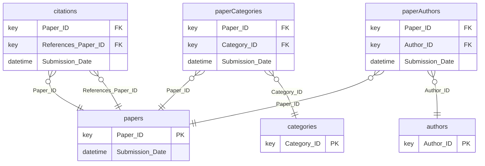

---
tags:
- relbench
- relational-deep-learning
pretty_name: rel-arxiv
---

# rel-arxiv

arXiv scholarly papers: papers, authors, citations, and subject categories.

## Schema



Splits: validation `2022-01-01`, test `2023-01-01` (rows up to a split's timestamp are the inputs for that split).

## Tasks

| task | kind | type | description |
|---|---|---|---|
| `author-category` | external | multiclass_classification | Predict the primary research category in which an author will publish papers in the next six months. |
| `author-publication` | forecast | regression | Predict how many papers an author will publish in the next six months. |
| `paper-citation` | forecast | binary_classification | Predict if a paper gets cited in the next 6 months. |
| `paper-paper-cocitation` | forecast | link_prediction | Predict which other papers will be cited together with a given paper in the next six months. |

## Loading

```python
import relbench
ds = relbench.load_dataset("rel-arxiv")
task = relbench.load_task("rel-arxiv", "<task>")
```

Manifest layout (`manifest.yaml` + plain parquet); see the RelBench [CONTRIBUTING guide](https://github.com/snap-stanford/relbench/blob/main/CONTRIBUTING.md).
