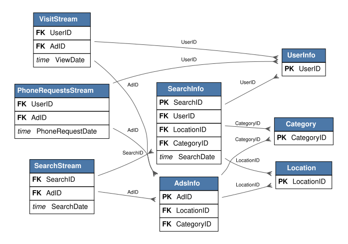

---
tags:
- relbench
- relational-deep-learning
pretty_name: rel-avito
---

# rel-avito

Avito online classifieds: users, ads, search queries, and impression / click / visit streams.

## Schema



Open [`schema.svg`](schema.svg) for a zoomable view of the foreign-key graph (PK = primary key, FK = foreign key).

Splits: validation `2015-05-08`, test `2015-05-14` (rows up to a split's timestamp are the inputs for that split).

## Tasks

| task | kind | type | description |
|---|---|---|---|
| `ad-ctr` | forecast | regression | Assuming the ad will be clicked in the next 4 days, predict the Click-Through- Rate (CTR) for each ad. |
| `searchinfo-isuserloggedon` | autocomplete | binary_classification | Predict the `IsUserLoggedOn` column of the `SearchInfo` table. |
| `searchstream-click` | autocomplete | binary_classification | Predict the `IsClick` column of the `SearchStream` table. |
| `user-ad-visit` | forecast | link_prediction | Predict the distinct list of ads a user will visit in the next 4 days. |
| `user-clicks` | forecast | binary_classification | Predict whether the each customer will click on more than one ads in the next 4 days. |
| `user-visits` | forecast | binary_classification | Predict whether each customer will visit more than one ad in the next 4 days. |

## Loading

```python
import relbench
ds = relbench.load_dataset("rel-avito")
task = relbench.load_task("rel-avito", "<task>")
```

Manifest layout (`manifest.yaml` + plain parquet); see the RelBench [CONTRIBUTING guide](https://github.com/snap-stanford/relbench/blob/main/CONTRIBUTING.md).
