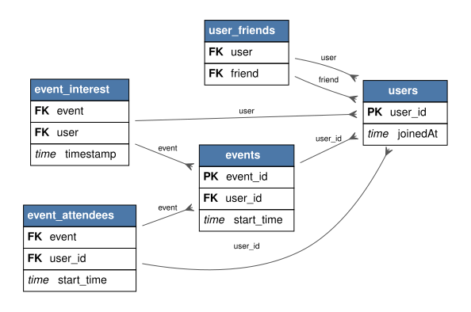

---
tags:
- relbench
- relational-deep-learning
pretty_name: rel-event
---

# rel-event

Event recommendation: users, events, attendance records, and social and interest signals.

## Schema



Open [`schema.svg`](schema.svg) for a zoomable view of the foreign-key graph (PK = primary key, FK = foreign key).

Splits: validation `2012-11-21`, test `2012-11-29` (rows up to a split's timestamp are the inputs for that split).

## Tasks

| task | kind | type | description |
|---|---|---|---|
| `event_interest-interested` | autocomplete | binary_classification | Predict the `interested` column of the `event_interest` table. |
| `event_interest-not_interested` | autocomplete | binary_classification | Predict the `not_interested` column of the `event_interest` table. |
| `user-attendance` | forecast | regression | Predict the number of events a user will go to in the next seven days 7 days. |
| `user-ignore` | forecast | binary_classification | Predict whether a user will ignore more than 2 event invitations in the next 7 days. |
| `user-repeat` | external | binary_classification | Predict whether a user will attend an event in the next 7 days if they have already attended an event in the last 14 days. |
| `users-birthyear` | autocomplete | regression | Predict the `birthyear` column of the `users` table. |

## Loading

```python
import relbench
ds = relbench.load_dataset("rel-event")
task = relbench.load_task("rel-event", "<task>")
```

Manifest layout (`manifest.yaml` + plain parquet); see the RelBench [CONTRIBUTING guide](https://github.com/snap-stanford/relbench/blob/main/CONTRIBUTING.md).
