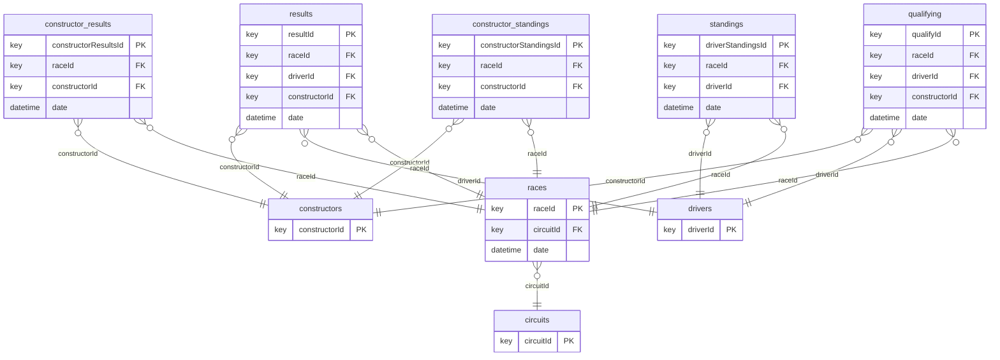

# rel-f1

Formula 1 motorsport database: races, drivers, constructors, circuits, race results, qualifying, and championship standings.

## Schema



Splits: validation `2005-01-01`, test `2010-01-01` (rows up to a split's timestamp are the inputs for that split).

## Tasks

| task | kind | type | description |
|---|---|---|---|
| `driver-circuit-compete` | forecast | link_prediction | Predict which circuits a driver will compete on in the next year. |
| `driver-dnf` | forecast | binary_classification | Predict whether each driver will fail to finish (DNF) a race in the next month. |
| `driver-position` | forecast | regression | Predict each driver's average finishing position across races in the next 2 months. |
| `driver-top3` | forecast | binary_classification | Predict whether each driver will qualify in the top 3 for a race in the next month. |
| `qualifying-position` | autocomplete | regression | Predict the qualifying position recorded in each qualifying row. |
| `results-position` | autocomplete | regression | Predict the finishing position recorded in each result row. |

## Loading

```python
import relbench
ds = relbench.load_dataset("rel-f1")
task = relbench.load_task("rel-f1", "<task>")
```

Manifest layout (`manifest.yaml` + plain parquet); see the RelBench [CONTRIBUTING guide](https://github.com/snap-stanford/relbench/blob/main/CONTRIBUTING.md).
