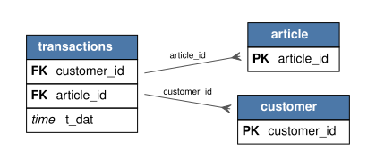

---
tags:
- relbench
- relational-deep-learning
pretty_name: rel-hm
---

# rel-hm

H&M e-commerce: customers, articles, and time-stamped purchase transactions.

## Schema



Open [`schema.svg`](schema.svg) for a zoomable view of the foreign-key graph (PK = primary key, FK = foreign key).

Splits: validation `2020-09-07`, test `2020-09-14` (rows up to a split's timestamp are the inputs for that split).

## Tasks

| task | kind | type | description |
|---|---|---|---|
| `item-sales` | forecast | regression | Predict the total sales for an article (the sum of prices of the associated transactions) in the next week. |
| `transactions-price` | autocomplete | regression | Predict the `price` column of the `transactions` table. |
| `user-churn` | forecast | binary_classification | Predict the churn for a customer (no transactions) in the next week. |
| `user-item-purchase` | forecast | link_prediction | Predict the list of articles each customer will purchase in the next seven days. |

## Loading

```python
import relbench
ds = relbench.load_dataset("rel-hm")
task = relbench.load_task("rel-hm", "<task>")
```

Manifest layout (`manifest.yaml` + plain parquet); see the RelBench [CONTRIBUTING guide](https://github.com/snap-stanford/relbench/blob/main/CONTRIBUTING.md).
