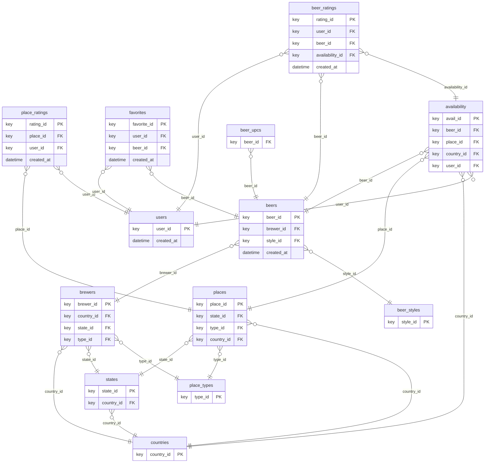

---
tags:
- relbench
- relational-deep-learning
pretty_name: rel-ratebeer
---

# rel-ratebeer

RateBeer reviews: users, beers, brewers, places, and time-stamped ratings.

## Schema



Splits: validation `2018-09-01`, test `2020-01-01` (rows up to a split's timestamp are the inputs for that split).

## Tasks

| task | kind | type | description |
|---|---|---|---|
| `beer-churn` | external | binary_classification | Predict whether a beer will receive a rating in the next 90 days. |
| `beer_ratings-total_score` | external | regression | regression task on `beer_ratings`. |
| `brewer-dormant` | external | binary_classification | Predict whether a brewer will release zero beers in the next 365 days. |
| `user-beer-favorite` | external | link_prediction | Predict the list of distinct beers each active user will add to their favorites in the next 90 days. |
| `user-beer-liked` | external | link_prediction | Predict the list of distinct beers each active user rates at least 4.0 / 5.0 in the next 90 days. |
| `user-churn` | external | binary_classification | Predict whether a user will give a beer rating in the next 90 days. |
| `user-count` | external | regression | Predict the number of beer ratings that a user will give in the next 90 days. |
| `user-place-liked` | external | link_prediction | Predict the list of distinct places each active user rates at least 80.0 / 100.0 in the next 90 days. |

## Loading

```python
import relbench
ds = relbench.load_dataset("rel-ratebeer")
task = relbench.load_task("rel-ratebeer", "<task>")
```

Manifest layout (`manifest.yaml` + plain parquet); see the RelBench [CONTRIBUTING guide](https://github.com/snap-stanford/relbench/blob/main/CONTRIBUTING.md).
