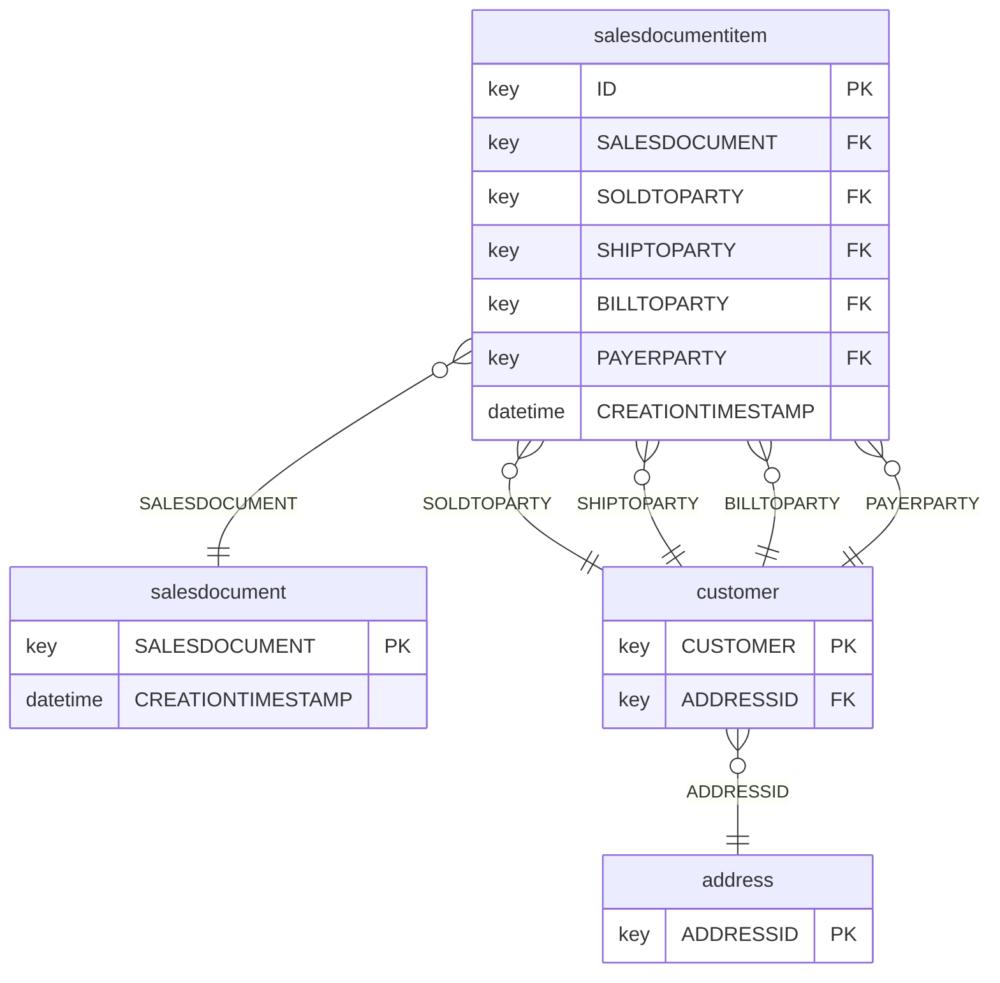

---
tags:
- relbench
- relational-deep-learning
pretty_name: rel-salt
---

# rel-salt

SAP SALT sales documents: sales orders, line items, customers, and addresses.

## Schema



Splits: validation `2020-02-01`, test `2020-07-01` (rows up to a split's timestamp are the inputs for that split).

## Tasks

| task | kind | type | description |
|---|---|---|---|
| `item-incoterms` | autocomplete | multiclass_classification | Predict the `ITEMINCOTERMSCLASSIFICATION` column of the `salesdocumentitem` table. |
| `item-plant` | autocomplete | multiclass_classification | Predict the `PLANT` column of the `salesdocumentitem` table. |
| `item-shippoint` | autocomplete | multiclass_classification | Predict the `SHIPPINGPOINT` column of the `salesdocumentitem` table. |
| `sales-group` | autocomplete | multiclass_classification | Predict the `SALESGROUP` column of the `salesdocument` table. |
| `sales-incoterms` | autocomplete | multiclass_classification | Predict the `HEADERINCOTERMSCLASSIFICATION` column of the `salesdocument` table. |
| `sales-office` | autocomplete | multiclass_classification | Predict the `SALESOFFICE` column of the `salesdocument` table. |
| `sales-payterms` | autocomplete | multiclass_classification | Predict the `CUSTOMERPAYMENTTERMS` column of the `salesdocument` table. |
| `sales-shipcond` | autocomplete | multiclass_classification | Predict the `SHIPPINGCONDITION` column of the `salesdocument` table. |

## Loading

```python
import relbench
ds = relbench.load_dataset("rel-salt")
task = relbench.load_task("rel-salt", "<task>")
```

Manifest layout (`manifest.yaml` + plain parquet); see the RelBench [CONTRIBUTING guide](https://github.com/snap-stanford/relbench/blob/main/CONTRIBUTING.md).
