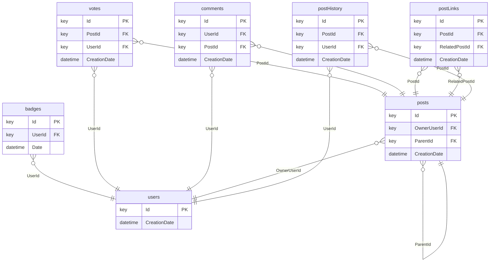

---
tags:
- relbench
- relational-deep-learning
pretty_name: rel-stack
---

# rel-stack

Stack Exchange Q&A: users, posts, comments, votes, badges, and post links.

## Schema



Splits: validation `2020-10-01`, test `2021-01-01` (rows up to a split's timestamp are the inputs for that split).

## Tasks

| task | kind | type | description |
|---|---|---|---|
| `badges-class` | autocomplete | multiclass_classification | Predict the `Class` column of the `badges` table. |
| `post-post-related` | forecast | link_prediction | Predict a list of existing posts that users will link a given post to in the next two years. |
| `post-votes` | forecast | regression | Predict the number of upvotes that an existing question will receive in the next 2 years. |
| `user-badge` | forecast | binary_classification | Predict if each user will receive in a new badge the next 2 years. |
| `user-engagement` | forecast | binary_classification | Predict if a user will make any votes/posts/comments in the next 2 years. |
| `user-post-comment` | forecast | link_prediction | Predict a list of existing posts that a user will comment in the next two years. |

## Loading

```python
import relbench
ds = relbench.load_dataset("rel-stack")
task = relbench.load_task("rel-stack", "<task>")
```

Manifest layout (`manifest.yaml` + plain parquet); see the RelBench [CONTRIBUTING guide](https://github.com/snap-stanford/relbench/blob/main/CONTRIBUTING.md).
