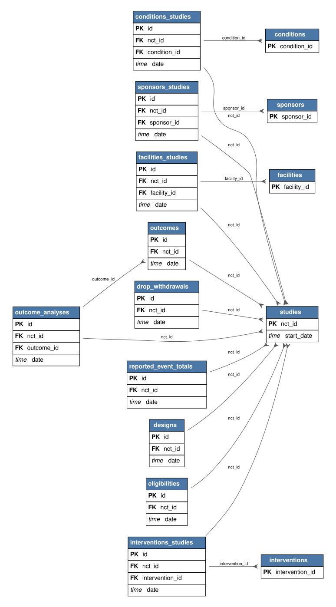

---
tags:
- relbench
- relational-deep-learning
pretty_name: rel-trial
---

# rel-trial

ClinicalTrials.gov clinical trials: studies, outcomes, adverse events, eligibilities, sponsors, conditions, and facilities.

## Schema



Open [`schema.svg`](schema.svg) for a zoomable view of the foreign-key graph (PK = primary key, FK = foreign key).

Splits: validation `2020-01-01`, test `2021-01-01` (rows up to a split's timestamp are the inputs for that split).

## Tasks

| task | kind | type | description |
|---|---|---|---|
| `condition-sponsor-run` | forecast | link_prediction | Predict whether this condition will have which sponsors. |
| `eligibilities-adult` | autocomplete | binary_classification | Predict the `adult` column of the `eligibilities` table. |
| `eligibilities-child` | autocomplete | binary_classification | Predict the `child` column of the `eligibilities` table. |
| `site-sponsor-run` | forecast | link_prediction | Predict whether this sponsor will have a trial in a facility. |
| `site-success` | forecast | regression | Predict the success rate of a trial site in the next 1 year. |
| `studies-enrollment` | autocomplete | regression | Predict the `enrollment` column of the `studies` table. |
| `studies-has_dmc` | autocomplete | binary_classification | Predict the `has_dmc` column of the `studies` table. |
| `study-adverse` | forecast | regression | Predict the number of affected patients with severe advsere events/death for the trial in the next 1 year. |
| `study-outcome` | forecast | binary_classification | Predict if the trials in the next 1 year will achieve its primary outcome. |

## Loading

```python
import relbench
ds = relbench.load_dataset("rel-trial")
task = relbench.load_task("rel-trial", "<task>")
```

Manifest layout (`manifest.yaml` + plain parquet); see the RelBench [CONTRIBUTING guide](https://github.com/snap-stanford/relbench/blob/main/CONTRIBUTING.md).
